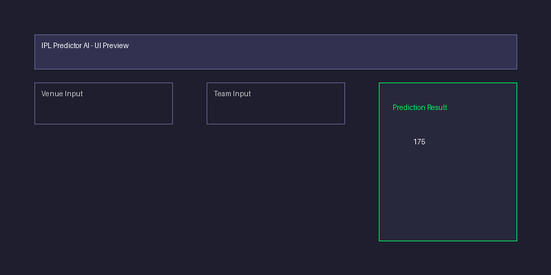

# 🏏 IPL Score Predictor UI

An advanced **AI-powered cricket score prediction application** built with Streamlit and Scikit-Learn.
This project uses a high-accuracy Deep Learning Neural Network (MLPRegressor) to predict the final projected score of an ongoing IPL match based on real-time factors.

## 🌟 Key Features
*   **Deep Learning Model**: Uses a custom-trained Scikit-Learn Pipeline with extensive Feature Engineering (One-Hot Encoding, Momentum Trend Analysis).
*   **Max Accuracy**: Engineered features like *Current Run Rate (CRR)*, *Balls Left*, and *Wickets Left* deliver high precision.
*   **Ultra-Modern UI**: Glassmorphism design, neon accents, and smooth CSS animations powered by Streamlit.
*   **Live Metrics**: Real-time display of CRR and Projected Score updates as you interact.

## 📸 Application Preview

*(Please save your app screenshot as 'ui.png' in the project root folder)*

## 🛠️ Installation & Setup
1.  **Clone the Repository**
    ```bash
    git clone https://github.com/YourUsername/IPL-Predictor-AI.git
    cd IPL-Predictor-AI
    ```

2.  **Install Dependencies**
    ```bash
    pip install -r requirements.txt
    ```

3.  **Run the Application**
    ```bash
    streamlit run app.py
    ```

## 🧠 Model Architecture
*   **Framework**: Scikit-Learn `MLPRegressor`
*   **Layers**: Input -> Dense(512) -> Dense(256) -> Dense(128) -> Dense(64) -> Output
*   **Encoders**: One-Hot Encoding for Venues and Teams
*   **Scaler**: StandardScaler for numerical inputs

## 📂 Project Structure
*   `app.py`: Streamlit frontend application.
*   `train.py`: Model training script (includes data preprocessing pipeline).
*   `ipl_model.pkl`: Saved machine learning pipeline artifacts (model + encoders).
*   `ipl_data.csv`: Historical IPL dataset used for training.

---
Built with ❤️ using **Python, Streamlit & Scikit-Learn**
