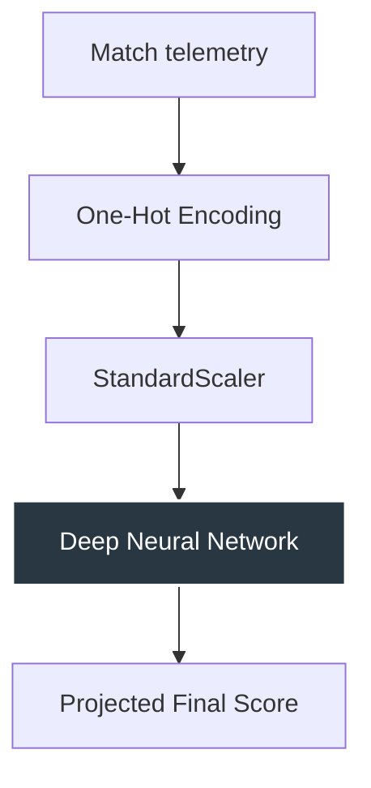

<div align="center">
  

  <br/>
  
  [](https://python.org)
  [](https://scikit-learn.org)
  [](https://streamlit.io)
  [](https://github.com/HarshChoudhary2003)

</div>

---

## 🏏 Overview
An advanced **AI-powered cricket intelligence platform** that predicts final projected scores for IPL matches. Utilizing a high-accuracy Deep Learning Neural Network (`MLPRegressor`), the system analyzes real-time momentum, ground conditions, and historical trends.

### 🌟 Project Armor
- 🧠 **Neural Core**: Multi-layer Perceptron (MLP) architecture.
- ⚡ **Momentum Engine**: Features tracking CRR, Balls Left, and Wicket impact.
- 🎨 **Hyper-Modern UI**: Glassmorphism dashboard with neon tactical accents.
- 📊 **Live Analytics**: Real-time score projection updates.

---

## 🏗️ Neural Architecture


---

## 🚀 Deployment Manual
1. **Core Ignition**:
   ```bash
   pip install -r requirements.txt
   ```
2. **Launch Visualizer**:
   ```bash
   streamlit run app.py
   ```

---

<div align="center">
  <h3>⭐ If you found this sports intelligence core useful, please consider giving it a star!</h3>
  <p>Made with ❤️ by <a href="https://github.com/HarshChoudhary2003">Harsh Choudhary</a></p>
  
</div>
