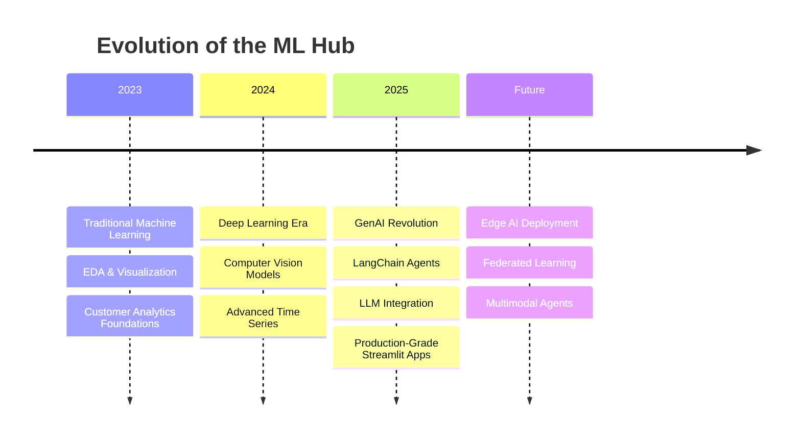

<div align="center">
  

  <br/>
  
  [](https://github.com/HarshChoudhary2003/Machine_Learning_Projects/stargazers)
  [](https://github.com/HarshChoudhary2003/Machine_Learning_Projects/network/members)
  [](https://github.com/HarshChoudhary2003/Machine_Learning_Projects/blob/main/LICENSE)
  [](https://visitorbadge.io/status?path=HarshChoudhary2003/Machine_Learning_Projects)

  <br/>
  
  

  <a href="https://machine-learning-projects.streamlit.app/">
    
  </a>


</div>

---

## 📖 Table of Contents

<details open>
<summary><b>Quick Navigation</b></summary>

- [🎯 Overview](#-overview)
- [🌟 Featured Projects](#-featured-projects)
- [📂 All Projects](#-all-projects)
  - [🌐 Streamlit Web Apps](#-streamlit-web-applications)
  - [🤖 Agentic AI & LLMs](#-agentic-ai--llms)
  - [📈 Financial & Stock Prediction](#-financial--stock-prediction)
  - [🛡️ Security & Fraud Detection](#️-security--fraud-detection)
  - [📊 Customer Analytics](#-customer-analytics)
  - [🧠 NLP & Text Analysis](#-nlp--text-analysis)
  - [👁️ Computer Vision](#️-computer-vision)
  - [🏠 Real Estate & Housing](#-real-estate--housing)
  - [🏥 Healthcare & Sustainability](#-healthcare--sustainability)
  - [🎬 Recommendation Systems](#-recommendation-systems)
  - [💼 Business & Sports Intelligence](#-business--sports-intelligence)
- [🛠️ Tech Stack](#️-tech-stack)
- [📊 Repository Stats](#-repository-stats)
- [🚀 Getting Started](#-getting-started)
- [📈 Project Roadmap](#-project-roadmap)
- [🤝 Contributing](#-contributing)
- [📧 Contact](#-contact)

</details>

---

## 🎯 Overview

Welcome to the **Machine Learning Projects Hub**! 🚀 

This repository is a curated collection of **30+ end-to-end projects** spanning the entire landscape of Data Science, Machine Learning, and Artificial Intelligence. Whether you are a beginner looking to learn or an expert seeking reference implementations, this hub has something for everyone.

> **Why this Repo?**  
> Every project here is designed to be **production-ready**, featuring clean code, robust error handling, and comprehensive documentation. We bridge the gap between theoretical ML and real-world application.

<div align="center">

| 📊 Projects | 🏷️ Categories | 🔧 Technologies | 📈 Focus Areas |
|:-----------:|:-------------:|:---------------:|:--------------:|
| **30+** | **10** | **15+** | **Finance, NLP, CV, Agents** |

</div>

### 🌟 Key Highlights

- **✅ Real-World Applications**: Solve actual business problems like Churn Prediction, Fraud Detection, and Stock Forecasting.
- **✅ Full-Stack Integration**: Many projects include **Streamlit** web apps for interactive demos.
- **✅ Modern AI Stack**: Implementations using **LangChain, OpenAI, Groq, and LLMs**.
- **✅ MLOps Practices**: Integration with tools like **MLflow** for experiment tracking.
- **✅ Diverse Domains**: From Healthcare to Finance, Sports to Social Media.

---

## 🏗️ Architecture & Workflow

<div align="center">

### 🔄 Standard ML Pipeline


</div>

---

## 🌟 Featured Projects

<table width="100%">
<tr>
<td width="33%" valign="top">

### 🧳 Agentic AI Travel Assistant
**Tech:** `LangChain` `OpenAI` `Groq` `Streamlit`

An autonomous multi-agent system that plans personalized travel itineraries using real-time data. The future of travel planning is here.

[](./Agentic%20AI-Based%20Travel%20Planning%20Assistant%20using%20LangChain)

</td>
<td width="33%" valign="top">

### � AI Resume Screening
**Tech:** `NLP` `Streamlit` `Plotly` `Lottie`

Next-gen recruitment tool featuring Glassmorphism UI, skill extraction, and interactive analytics.

[](./Resume%20Screening%20App)

</td>
<td width="33%" valign="top">

### 📈 Tesla Stock Prediction
**Tech:** `LSTM` `TensorFlow` `Streamlit` `Keras`

Advanced Deep Learning time-series forecasting model to predict TSLA stock prices, visualized in an interactive dashboard.

[](./Tesla%20Stock%20Price%20Prediction)

</td>
</tr>
<tr>
<td width="33%" valign="top">

### 💳 Credit Card Fraud Detection
**Tech:** `SMOTE` `XGBoost` `Scikit-Learn`

Tackling extreme class imbalance to detect fraudulent transactions with precision. Essential for Fintech security.

[](./Credit%20Card%20Fraud%20Detection%20-%20ML)

</td>
<td width="33%" valign="top">

### 💼 SkillSync Pro
**Tech:** `Web Scraping` `ML` `Streamlit` `SQLite`

A comprehensive job market analyzer that scrapes data and predicts salaries based on skills and experience.

[](./SkillSync)

</td>
<td width="33%" valign="top">

### ⚡ AI Energy Saver
**Tech:** `Regression` `API` `Pandas` `Matplotlib`

Smart energy consumption predictor to help households and businesses reduce costs and their carbon footprint.

[](./AI-Energy-Saver)

</td>
</tr>
</table>

---

## 📂 All Projects

### 🌐 Streamlit Web Applications

Interactive web applications deployed directly from the repo.

| Project | Description | Technologies | Link |
|---------|-------------|--------------|------|
| 📄 **AI Resume Screening** | 🚀 Ranking System with Glassmorphism UI | Streamlit, NLP, Plotly | [👉 View](./Resume%20Screening%20App) |
| ⚡ **AI Energy Saver** | Advanced energy dashboard with animations | Streamlit, Plotly, Lottie | [👉 View](./AI-Energy-Saver) |
| 🏥 **Medical Insurance Prediction** | Premium calculator with dark mode UI | Streamlit, XGBoost, Plotly | [👉 View](./Medical%20Insurance%20Price%20Prediction%20using%20Machine%20Learning) |
| 📰 **Fake News Detector** | Cyberpunk-themed misinformation detector | Streamlit, NLP, Lottie | [👉 View](./Fake%20News%20Detector) |
| 🏢 **Real Estate Investment Advisor** | AI property analyzer with Glassmorphism | Streamlit, ML, Plotly | [👉 View](./Real%20Estate%20Investment%20Advisor) |
| 🧳 **Agentic AI Travel Assistant** | Autonomous travel planner | LangChain, OpenAI, Streamlit | [👉 View](./Agentic%20AI-Based%20Travel%20Planning%20Assistant%20using%20LangChain) |
| 🚀 **Tesla Stock Prediction** | Interactive stock forecasting app | LSTM, TensorFlow, Streamlit | [👉 View](./Tesla%20Stock%20Price%20Prediction) |
| 💼 **SkillSync Pro** | Job market & salary analyzer | Web Scraping, Streamlit, SQLite | [👉 View](./SkillSync) |
| 💳 **EMI Precision AI** | AI-powered loan eligibility & risk assessment | XGBoost, Streamlit, MLflow | [👉 View](./EMI%20Predict) |
| 🎙️ **Nova Voice Assistant** | Interactive AI assistant with speech | Streamlit, pyttsx3, SpeechRec | [👉 View](./Voice%20Assistant%20using%20python) |
| 😊 **MoodFlix (Emotion Rec)** | Mood-based movie recommender with Modern UI | FastAPI, React, Tailwind | [👉 View](./Movie%20recommendation%20based%20on%20emotion) |

---


### 🤖 Agentic AI & LLMs

Cutting-edge projects utilizing Large Language Models and Autonomous Agents.

| Project | Description | Technologies | Link |
|---------|-------------|--------------|------|
| 🧳 **Agentic AI Travel Assistant** | Multi-agent autonomous travel planner | LangChain, OpenAI, Groq | [👉 View](./Agentic%20AI-Based%20Travel%20Planning%20Assistant%20using%20LangChain) |
| 🎙️ **Voice Assistant** | Personal AI assistant with Wikipedia & Web access | pyttsx3, SpeechRecognition | [👉 View](./Voice%20Assistant%20using%20python) |

---

### 📈 Financial & Stock Prediction

Time-series forecasting and regression models for the financial sector.

| Project | Description | Technologies | Link |
|---------|-------------|--------------|------|
| 🪙 **Bitcoin Price Prediction** | Cryptocurrency trend forecasting with Dashboard | Streamlit, Plotly, Lottie | [👉 View](./Bitcoin%20Price%20Prediction%20using%20Machine%20Learning%20in%20Python) |
| 🐕 **Dogecoin Price Prediction** | Meme coin price analysis | ML Regression, Matplotlib | [👉 View](./Dogecoin%20Price%20Prediction%20with%20Machine%20Learning) |
| 📊 **Microsoft Stock Prediction** | MSFT price forecasting with LSTM | TensorFlow, Keras, LSTM | [👉 View](./Microsoft%20Stock%20Price%20Prediction%20with%20Machine%20Learning) |
| 🚀 **Tesla Stock Prediction** | TSLA forecasting + web app | LSTM, Streamlit, TensorFlow | [👉 View](./Tesla%20Stock%20Price%20Prediction) |
| 📈 **Stock Price Prediction** | General stock forecasting | Deep Learning, Time Series | [👉 View](./Stock%20Price%20Prediction%20using%20Machine%20Learning%20in%20Python) |
| 📈 **Predict Stock Direction (SVM)** | Predict market movement using SVM | Scikit-Learn, Pandas, SVM | [👉 View](./Predicting%20Stock%20Price%20Direction%20using%20Support%20Vector%20Machines) |
| 💳 **EMI Precision AI** | Loan eligibility with MLOps & Real-time AI | MLflow, Streamlit, XGBoost | [👉 View](./EMI%20Predict) |
| 🏦 **Loan Eligibility Prediction** | Predict loan approval status | Scikit-Learn, Pandas | [👉 View](./Loan%20Eligibility%20Prediction%20using%20Machine%20Learning) |

---

### 🛡️ Security & Fraud Detection

Cybersecurity applications using Machine Learning.

| Project | Description | Technologies | Link |
|---------|-------------|--------------|------|
| 💳 **Credit Card Fraud Detection** | Real-time Dashboard with Fraud Analysis | Streamlit, Plotly, Random Forest | [👉 View](./Credit%20Card%20Fraud%20Detection%20-%20ML) |
| 📰 **Fake News Detector** | Misinformation detection + web app | NLP, TF-IDF, Streamlit | [👉 View](./Fake%20News%20Detector) |
| 📧 **Email Spam Detection** | Spam classification with deep learning | TensorFlow, Keras | [👉 View](./Detecting%20Spam%20Emails%20Using%20Tensorflow) |
| 📱 **SMS Spam Detection** | Text message spam filter | TensorFlow, NLP | [👉 View](./SMS%20Spam%20Detection%20using%20TensorFlow) |

---

### 📊 Customer Analytics

Understanding customer behavior through data.

| Project | Description | Technologies | Link |
|---------|-------------|--------------|------|
| 📉 **Customer Churn Analysis** | Analyze & predict customer attrition | Scikit-Learn, EDA | [👉 View](./Customer%20Churn%20Analysis%20Prediction) |
| 📱 **Telecom Churn Prediction** | Advanced SaaS churn prediction | XGBoost, Feature Engineering | [👉 View](./Customer%20Churn%20Prediction%20%28Telecom%20%20SaaS%29) |
| 🛍️ **Customer Purchase Prediction** | Predict likelihood of purchase | Scikit-Learn, Random Forest | [👉 View](./Customer%20Purchase%20Prediction) |
| 🎯 **Customer Segmentation** | Unsupervised clustering | K-Means, PCA | [👉 View](./Customer%20Segmentation%20using%20Unsupervised%20Machine%20Learning) |
| 🛒 **Flipkart Sentiment Analysis** | E-commerce review analysis | NLP, NLTK, TextBlob | [👉 View](./Flipkart%20Reviews%20Sentiment%20Analysis) |

---

### 🧠 NLP & Text Analysis

Natural Language Processing projects.

| Project | Description | Technologies | Link |
|---------|-------------|--------------|------|
| 📝 **Text Classification (Naive Bayes)** | Document categorization | NLP, TF-IDF | [👉 View](./Classification%20of%20Text%20Documents%20using%20Naive%20Bayes) |
| 🎬 **Netflix Content Clustering** | Content recommendation system | K-Means, NLP | [👉 View](./NETFLIX%20MOVIES%20AND%20TV%20SHOWS%20CLUSTERING) |
| 🍽️ **Restaurant Review NLP** | Sentiment analysis of restaurant reviews | NLTK, Bag of Words | [👉 View](./NLP%20analysis%20of%20Restaurant%20reviews) |
| 📘 **Facebook Sentiment Analysis** | Sentiment analysis of FB posts | NLTK, VADER | [👉 View](./Facebook%20Sentiment%20Analysis%20using%20python) |
| 🎙️ **Speech Recognition** | Speech-to-text with Google API | Google Speech API, pydub | [👉 View](./Speech%20Recognition%20in%20Python%20using%20Google%20Speech%20API) |

---

### 👁️ Computer Vision

Image processing and recognition.

| Project | Description | Technologies | Link |
|---------|-------------|--------------|------|
| ✋ **Handwritten Digit Recognition** | MNIST classification with NN | TensorFlow, Keras, CNN | [👉 View](./Handwritten%20Digit%20Recognition%20using%20Neural%20Network) |
| 🔢 **Handwritten Digits (Scikit-Learn)** | Digit recognition using MLP | Scikit-Learn, MLP | [👉 View](./Recognizing%20HandWritten%20Digits%20in%20Scikit%20Learn) |
| 🔢 **Object Counter** | Count objects in images | OpenCV, Python | [👉 View](./Count%20number%20of%20Object%20using%20Python-OpenCV) |
| 👤 **Face Recognition** | Real-time face detection & tracking | Roboflow, Supervision | [👉 View](./Face%20Recognition) |

---

### 🏠 Real Estate & Housing

Property market analysis.

| Project | Description | Technologies | Link |
|---------|-------------|--------------|------|
| 🏠 **House Price Prediction** | Property value estimation | Regression, Feature Engineering | [👉 View](./House%20Price%20Prediction%20using%20Machine%20Learning) |
| 🏘️ **Zillow Zestimate Prediction** | Home value prediction | XGBoost, LightGBM | [👉 View](./Zillow%20Home%20Value%20%28Zestimate%29%20Prediction%20in%20ML) |
| 🏢 **Real Estate Investment Advisor** | Investment analysis platform | ML, Streamlit, MLflow | [👉 View](./Real%20Estate%20Investment%20Advisor) |
| 🎬 **Box Office Revenue Prediction** | Movie revenue forecasting | Linear Regression | [👉 View](./Box%20Office%20Revenue%20Prediction%20Using%20Linear%20Regression%20in%20ML) |

---

### 🏥 Healthcare & Sustainability

Medical and environmental projects.

| Project | Description | Technologies | Link |
|---------|-------------|--------------|------|
| ❤️ **Heart Disease Prediction** | Diagnose cardiac issues with ML | Logistic Regression | [👉 View](./Heart%20Disease%20Prediction%20Using%20Logistic%20Regression) |
| ⚡ **AI Energy Saver** | Energy consumption prediction | Regression, API | [👉 View](./AI-Energy-Saver) |
| 🌫️ **Air Quality Prediction** | Predicting AQI with Neural Networks | TensorFlow, Keras | [👉 View](./Predicting%20Air%20Quality%20with%20Neural%20Networks) |
| 🦠 **Cancer Cell Classification** | Diagnose malignant vs benign cells | Naive Bayes | [👉 View](./Cancer%20cell%20classification%20using%20Scikit-learn) |
| 🔥 **Calories Burnt Prediction** | Predict calories burnt during exercise | XGBoost, Pandas | [👉 View](./Calories%20Burnt%20Prediction%20using%20Machine%20Learning) |
| 🌧️ **Rainfall Prediction** | Predict rainfall using Linear Regression | Linear Regression | [👉 View](./rainfall-prediction-project) |
| 🩺 **Tumor Detection** | Detect tumors using Machine Learning | Scikit-Learn, Pandas | [👉 View](./Tumor_Detection-project) |
| 🏥 **Medical Insurance Prediction** | Predict insurance premium with XGBoost | XGBoost, Streamlit | [👉 View](./Medical%20Insurance%20Price%20Prediction%20using%20Machine%20Learning) |

---

### 🎬 Recommendation Systems

Personalization algorithms.

| Project | Description | Technologies | Link |
|---------|-------------|--------------|------|
| 🍿 **Movie Recommender** | Content-based recommendation | Cosine Similarity, NLP | [👉 View](./Movie%20Recommender%20System) |
| 😊 **MoodFlix (Emotion Rec)**| Mood-based movie recommender with Modern UI | FastAPI, React, Tailwind | [👉 View](./Movie%20recommendation%20based%20on%20emotion) |
| 🎙️ **Ted Talks Recommendation** | Text-based similarity for talks | Scikit-Learn, TF-IDF | [👉 View](./Ted%20Talks%20Recommendation%20System%20with%20Machine%20Learning) |

---

### 💼 Business & Sports Intelligence

Analytics for decision making.

| Project | Description | Technologies | Link |
|---------|-------------|--------------|------|
| 📄 **AI Resume Screening** | Automated resume parsing & ranking | NLP, TF-IDF, Streamlit | [👉 View](./Resume%20Screening%20App) |
| 📉 **Sales Forecast Prediction** | Time series sales forecasting | XGBoost, Time Series | [👉 View](./Sales%20Forecast%20Prediction%20-%20Python) |
| 💼 **SkillSync Pro** | Job market analyzer + salary prediction | Web Scraping, ML, Streamlit | [👉 View](./SkillSync) |
| 🏏 **IPL Score Prediction** | Live match score forecasting | Deep Learning, Keras | [👉 View](./IPL%20Score%20Prediction%20using%20Deep%20Learning) |

---

## 🛠️ Tech Stack

<div align="center">

| | Technologies |
|:---:|:---|
| **Languages** |   |
| **ML & AI** |     |
| **LLMs & Agents** |   |
| **Data Viz** |     |
| **Deployment** |    |
| **CV** |  |

</div>

---

## 📊 Repository Stats

<div align="center">

[](https://github.com/HarshChoudhary2003)

[](https://github.com/HarshChoudhary2003)

</div>

---

## 🚀 Getting Started

Getting a project up and running is as simple as 1-2-3.

### ⚙️ Prerequisites

- Python 3.8+
- Git

### 📥 Installation & Usage

```bash
# 1. Clone the repository
git clone https://github.com/HarshChoudhary2003/Machine_Learning_Projects.git

# 2. Navigate to your desired project
cd Machine_Learning_Projects/"Project Name"

# 3. Install dependencies
pip install -r requirements.txt

# 4. Run the application
python app.py  # or streamlit run app.py
```

---

## 📈 Project Roadmap



---

## 🤝 Contributing

Contributions are the heart of open-source! 💖 

1. **Fork** the repo
2. **Clone** your fork (`git clone ...`)
3. **Branch** it (`git checkout -b feature/CoolFeature`)
4. **Commit** changes (`git commit -m 'Added CoolFeature'`)
5. **Push** to branch (`git push origin feature/CoolFeature`)
6. **Open** a Pull Request

<div align="center">
  <a href="https://github.com/HarshChoudhary2003/Machine_Learning_Projects/graphs/contributors">
  
  </a>
</div>

---

## 📧 Contact

<div align="center">

| | | |
|:---:|:---:|:---:|
| [](www.linkedin.com/in/harshchoudhary2003) | [](https://github.com/HarshChoudhary2003) | [](mailto:hc504360@gmail.com) |

</div>

---

<div align="center">
  
  
  
  <br/>
  
  <h3 align="center">⭐ Star this repo if you found it useful! ⭐</h3>
  
  
  
  
</div>
