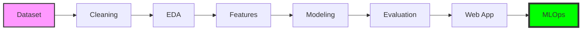
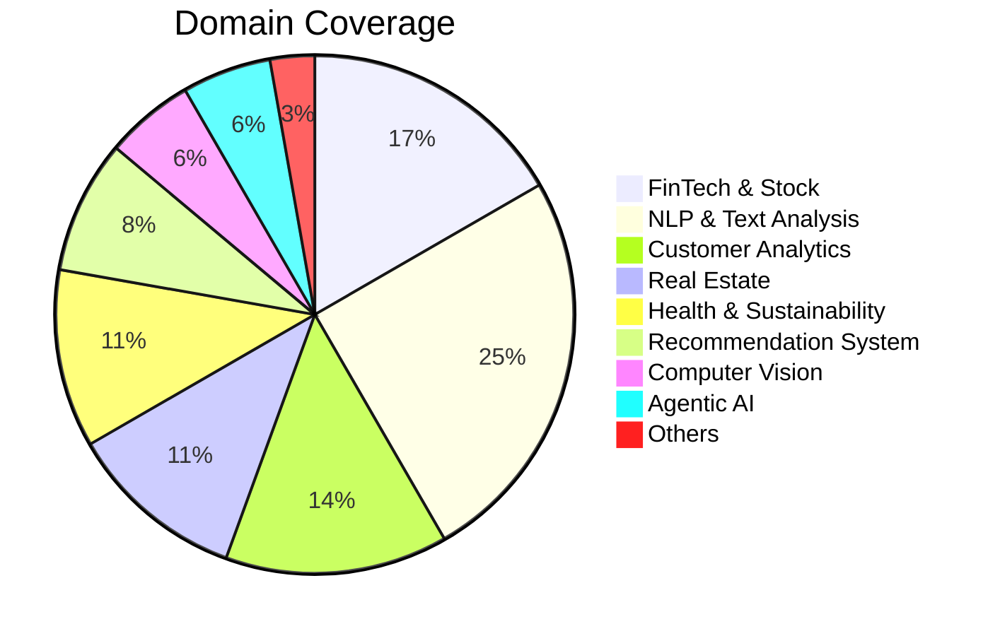
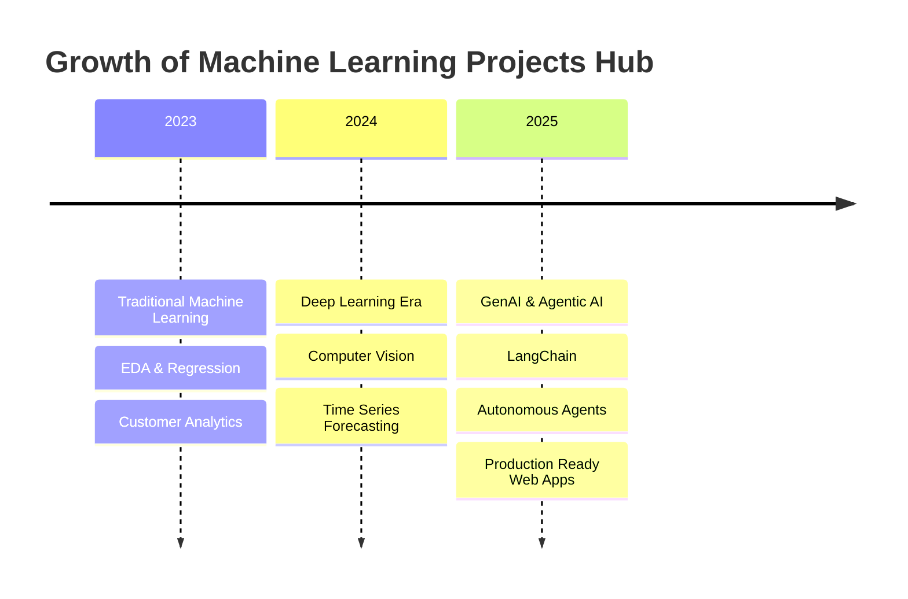

<div align="center">
  

  <br/>
  
  [](https://github.com/HarshChoudhary2003/Machine_Learning_Projects/stargazers)
  [](https://github.com/HarshChoudhary2003/Machine_Learning_Projects/network/members)
  [](https://github.com/HarshChoudhary2003/Machine_Learning_Projects/blob/main/LICENSE)
  [](https://www.python.org/)
  [](https://tensorflow.org)
  [](https://scikit-learn.org)

  <br/>
  
  

</div>

---

## 📖 Table of Contents

<details open>
<summary><b>Quick Navigation</b></summary>

- [🎯 Overview](#-overview)
- [🌟 Featured Projects](#-featured-projects)
- [📂 All Projects](#-all-projects)
  - [🤖 Agentic AI & LLMs](#-agentic-ai--llms)
  - [📈 Financial & Stock Prediction](#-financial--stock-prediction)
  - [🛡️ Security & Fraud Detection](#️-security--fraud-detection)
  - [📊 Customer Analytics](#-customer-analytics)
  - [🧠 NLP & Text Analysis](#-nlp--text-analysis)
  - [👁️ Computer Vision](#️-computer-vision)
  - [🏠 Real Estate & Housing](#-real-estate--housing)
  - [🏥 Healthcare & Sustainability](#-healthcare--sustainability)
  - [🎬 Recommendation Systems](#-recommendation-systems)
  - [💼 Business & Sports Intelligence](#-business--sports-intelligence)
- [🛠️ Tech Stack](#️-tech-stack)
- [🚀 Getting Started](#-getting-started)
- [📊 Project Roadmap](#-project-roadmap)
- [🤝 Contributing](#-contributing)
- [📧 Contact](#-contact)

</details>

---

## 🎯 Overview

Welcome to the **Machine Learning Projects Hub**! 🚀 

This repository is a comprehensive collection of **30+ end-to-end projects** spanning the entire landscape of Data Science, Machine Learning, and Artificial Intelligence. Each project is **production-ready** with proper documentation, clean code, and detailed explanations.

<div align="center">

| 📊 Projects | 🏷️ Categories | 🔧 Technologies | 📈 Focus Areas |
|:-----------:|:-------------:|:---------------:|:--------------:|
| **30+** | **10** | **15+** | **Finance, NLP, CV, Agents** |

</div>

### 🌟 What Makes This Special?

```
┌─────────────────────────────────────────────────────────────────────┐
│                    🎯 KEY HIGHLIGHTS                                │
├─────────────────────────────────────────────────────────────────────┤
│  ✅ Real-World Applications    │  ✅ Production-Ready Code         │
│  ✅ Comprehensive Documentation │  ✅ Web Apps (Streamlit)         │
│  ✅ Modern AI (LangChain, LLMs) │  ✅ MLOps (MLflow tracking)      │
│  ✅ Deep Learning (TensorFlow)  │  ✅ Traditional ML (Scikit-Learn)│
└─────────────────────────────────────────────────────────────────────┘
```

---

## 🏗️ Project Lifecycle & Distribution

<div align="center">

### 🔄 Standard ML Workflow



### 📊 Project Distribution



</div>

---

## 🌟 Featured Projects

<table>
<tr>
<td width="33%" valign="top">

### 🧳 Agentic AI Travel Assistant
**Technologies:** `LangChain` `OpenAI` `Groq` `Streamlit`

An autonomous multi-agent system that plans personalized travel itineraries using real-time data.

[](./Agentic%20AI-Based%20Travel%20Planning%20Assistant%20using%20LangChain)

</td>
<td width="33%" valign="top">

### 📰 Fake News Detector
**Technologies:** `NLP` `TF-IDF` `Streamlit` `Scikit-Learn`

ML-powered system to detect misinformation with 93%+ accuracy and web interface.

[](./Fake%20News%20Dectotor)

</td>
<td width="33%" valign="top">

### 📈 Tesla Stock Prediction
**Technologies:** `LSTM` `TensorFlow` `Streamlit` `Keras`

Deep learning time-series forecasting with interactive web dashboard.

[](./Tesla%20Stock%20Price%20Prediction)

</td>
</tr>
<tr>
<td width="33%" valign="top">

### 💳 Credit Card Fraud Detection
**Technologies:** `SMOTE` `XGBoost` `Scikit-Learn`

Handle extreme class imbalance to detect fraudulent transactions.

[](./Credit%20Card%20Fraud%20Detection%20-%20ML)

</td>
<td width="33%" valign="top">

### 💼 SkillSync Pro
**Technologies:** `Web Scraping` `ML` `Streamlit` `SQLite`

Intelligent job market analyzer with salary prediction.

[](./SkillSync)

</td>
<td width="33%" valign="top">

### ⚡ AI Energy Saver
**Technologies:** `Regression` `API` `Pandas` `Matplotlib`

Predict energy consumption to reduce costs and carbon footprint.

[](./AI-Energy-Saver)

</td>
</tr>
</table>

---

## 📂 All Projects

### 🤖 Agentic AI & LLMs

| Project | Description | Technologies | Link |
|---------|-------------|--------------|------|
| 🧳 **Agentic AI Travel Assistant** | Multi-agent autonomous travel planner | LangChain, OpenAI, Groq, Streamlit | [→](./Agentic%20AI-Based%20Travel%20Planning%20Assistant%20using%20LangChain) |
| 🎙️ **Voice Assistant** | Personal AI assistant with Wikipedia & Web access | pyttsx3, SpeechRecognition, Python | [→](./Voice%20Assistant%20using%20python) |

---

### 📈 Financial & Stock Prediction

| Project | Description | Technologies | Link |
|---------|-------------|--------------|------|
| 🪙 **Bitcoin Price Prediction** | Cryptocurrency trend forecasting | Scikit-Learn, Pandas, Time Series | [→](./Bitcoin%20Price%20Prediction%20using%20Machine%20Learning%20in%20Python) |
| 🐕 **Dogecoin Price Prediction** | Meme coin price analysis | ML Regression, Matplotlib | [→](./Dogecoin%20Price%20Prediction%20with%20Machine%20Learning) |
| 📊 **Microsoft Stock Prediction** | MSFT price forecasting with LSTM | TensorFlow, Keras, LSTM | [→](./Microsoft%20Stock%20Price%20Prediction%20with%20Machine%20Learning) |
| 🚀 **Tesla Stock Prediction** | TSLA forecasting + web app | LSTM, Streamlit, TensorFlow | [→](./Tesla%20Stock%20Price%20Prediction) |
| 📈 **Stock Price Prediction** | General stock forecasting | Deep Learning, Time Series | [→](./Stock%20Price%20Prediction%20using%20Machine%20Learning%20in%20Python) |
| 📈 **Predict Stock Direction (SVM)** | Predict market movement using SVM | Scikit-Learn, Pandas, SVM | [→](./Predicting%20Stock%20Price%20Direction%20using%20Support%20Vector%20Machines) |
| 💳 **EMI Calculator** | Loan EMI prediction with MLOps | MLflow, Streamlit, Scikit-Learn | [→](./EMI) |

---

### 🛡️ Security & Fraud Detection

| Project | Description | Technologies | Link |
|---------|-------------|--------------|------|
| 💳 **Credit Card Fraud Detection** | Imbalanced classification for transactions | SMOTE, XGBoost, Scikit-Learn | [→](./Credit%20Card%20Fraud%20Detection%20-%20ML) |
| 📰 **Fake News Detector** | Misinformation detection + web app | NLP, TF-IDF, Streamlit | [→](./Fake%20News%20Dectotor) |
| 📧 **Email Spam Detection** | Spam classification with deep learning | TensorFlow, Keras, NLP | [→](./Detecting%20Spam%20Emails%20Using%20Tensorflow) |
| 📱 **SMS Spam Detection** | Text message spam filter | TensorFlow, NLP | [→](./SMS%20Spam%20Detection%20using%20TensorFlow) |

---

### 📊 Customer Analytics

| Project | Description | Technologies | Link |
|---------|-------------|--------------|------|
| 📉 **Customer Churn Analysis** | Analyze & predict customer attrition | Scikit-Learn, EDA, Pandas | [→](./Customer%20Churn%20Analysis%20Prediction) |
| 📱 **Telecom Churn Prediction** | Advanced SaaS churn prediction | XGBoost, Feature Engineering | [→](./Customer%20Churn%20Prediction%20%28Telecom%20%20SaaS%29) |
| 🛍️ **Customer Purchase Prediction** | Predict likelihood of purchase | Scikit-Learn, Random Forest | [→](./Customer%20Purchase%20Prediction) |
| 🎯 **Customer Segmentation** | Unsupervised clustering | K-Means, PCA, Scikit-Learn | [→](./Customer%20Segmentation%20using%20Unsupervised%20Machine%20Learning) |
| 🛒 **Flipkart Sentiment Analysis** | E-commerce review analysis | NLP, NLTK, TextBlob | [→](./Flipkart%20Reviews%20Sentiment%20Analysis) |

---

### 🧠 NLP & Text Analysis

| Project | Description | Technologies | Link |
|---------|-------------|--------------|------|
| 📝 **Text Classification (Naive Bayes)** | Document categorization | NLP, TF-IDF, Naive Bayes | [→](./Classification%20of%20Text%20Documents%20using%20Naive%20Bayes) |
| 🎬 **Netflix Content Clustering** | Content recommendation system | K-Means, NLP, Hierarchical | [→](./NETFLIX%20MOVIES%20AND%20TV%20SHOWS%20CLUSTERING) |
| 🍽️ **Restaurant Review NLP** | Sentiment analysis of restaurant reviews | NLTK, Bag of Words, Scikit-Learn | [→](./NLP%20analysis%20of%20Restaurant%20reviews) |
| 📘 **Facebook Sentiment Analysis** | Sentiment analysis of FB posts | NLTK, VADER, Python | [→](./Facebook%20Sentiment%20Analysis%20using%20python) |
| 🎙️ **Speech Recognition** | Speech-to-text with Google API | Google Speech API, pydub, Python | [→](./Speech%20Recognition%20in%20Python%20using%20Google%20Speech%20API) |

---

### 👁️ Computer Vision

| Project | Description | Technologies | Link |
|---------|-------------|--------------|------|
| ✋ **Handwritten Digit Recognition** | MNIST classification with NN | TensorFlow, Keras, CNN | [→](./Handwritten%20Digit%20Recognition%20using%20Neural%20Network) |
| 🔢 **Object Counter** | Count objects in images | OpenCV, Python, Image Processing | [→](./Count%20number%20of%20Object%20using%20Python-OpenCV) |

---

### 🏠 Real Estate & Housing

| Project | Description | Technologies | Link |
|---------|-------------|--------------|------|
| 🏠 **House Price Prediction** | Property value estimation | Regression, Feature Engineering | [→](./House%20Price%20Prediction%20using%20Machine%20Learning) |
| 🏘️ **Zillow Zestimate Prediction** | Home value prediction | XGBoost, LightGBM, Ensemble | [→](./Zillow%20Home%20Value%20%28Zestimate%29%20Prediction%20in%20ML) |
| 🏢 **Real Estate Investment Advisor** | Investment analysis platform | ML, Streamlit, MLflow | [→](./Real%20Estate%20Investment%20Advisor) |
| 🎬 **Box Office Revenue Prediction** | Movie revenue forecasting | Linear Regression | [→](./Box%20Office%20Revenue%20Prediction%20Using%20Linear%20Regression%20in%20ML) |

---

### 🏥 Healthcare & Sustainability

| Project | Description | Technologies | Link |
|---------|-------------|--------------|------|
| ❤️ **Heart Disease Prediction** | Diagnose cardiac issues with ML | Logistic Regression, Scikit-Learn | [→](./Heart%20Disease%20Prediction%20Using%20Logistic%20Regression) |
| ⚡ **AI Energy Saver** | Energy consumption prediction | Regression, API, Pandas | [→](./AI-Energy-Saver) |
| 🌫️ **Air Quality Prediction** | Predicting AQI with Neural Networks | TensorFlow, Keras, Pandas | [→](./Predicting%20Air%20Quality%20with%20Neural%20Networks) |
| 🦠 **Cancer Cell Classification** | Diagnose malignant vs benign cells | Naive Bayes, Scikit-Learn | [→](./Cancer%20cell%20classification%20using%20Scikit-learn) |

---

### 🎬 Recommendation Systems

| Project | Description | Technologies | Link |
|---------|-------------|--------------|------|
| 🍿 **Movie Recommender** | Content-based recommendation | Cosine Similarity, NLP | [→](./Movie%20Recommender%20System) |
| 😊 **Emotion Based Movie Rec**| Recommend movies based on mood | OpenCV, NLP, Streamlit | [→](./Movie%20recommendation%20based%20on%20emotion) |
| 🎙️ **Ted Talks Recommendation** | Text-based similarity for talks | Scikit-Learn, TF-IDF | [→](./Ted%20Talks%20Recommendation%20System%20with%20Machine%20Learning) |

---

### 💼 Business & Sports Intelligence

| Project | Description | Technologies | Link |
|---------|-------------|--------------|------|
| 📉 **Sales Forecast Prediction** | Time series sales forecasting | XGBoost, Time Series | [→](./Sales%20Forecast%20Prediction%20-%20Python) |
| 💼 **SkillSync Pro** | Job market analyzer + salary prediction | Web Scraping, ML, Streamlit | [→](./SkillSync) |
| 🏏 **IPL Score Prediction** | Live match score forecasting | Deep Learning, Keras | [→](./IPL%20Score%20Prediction%20using%20Deep%20Learning) |

---

## 🛠️ Tech Stack

<div align="center">

### 💻 Programming Languages


### 🤖 Machine Learning & AI


### 🦜 LLMs & Agents


### 📊 Data Science


### 🌐 Web & Deployment


### 👁️ Computer Vision


</div>

---

## 🚀 Getting Started

### ⚙️ Prerequisites

```bash
# Ensure Python 3.8+ is installed
python --version

# Install Jupyter (optional)
pip install jupyter
```

### 📥 Installation

```bash
# Clone the repository
git clone https://github.com/HarshChoudhary2003/Machine_Learning_Projects.git

# Navigate to the directory
cd Machine_Learning_Projects

# Create virtual environment (recommended)
python -m venv venv
source venv/bin/activate  # Linux/Mac
venv\Scripts\activate     # Windows

# Install common dependencies
pip install pandas numpy scikit-learn matplotlib seaborn jupyter
```

### 📖 Usage

1. 📂 **Browse** to any project folder
2. 📓 **Open** the `.ipynb` notebook or run `app.py` for web apps
3. 📚 **Read** the project-specific README for detailed instructions
4. 🚀 **Execute** the cells or run the scripts

```bash
# Example: Run a Streamlit app
cd "Fake News Dectotor"
pip install -r requirements.txt
streamlit run app.py
```

---

## 📊 Project Statistics

<div align="center">

```
╔═══════════════════════════════════════════════════════════════╗
║                    📈 REPOSITORY STATS                        ║
╠═══════════════════════════════════════════════════════════════╣
║  📂 Total Projects           │  30+                           ║
║  🏷️ Categories              │  10                             ║
║  🌐 Web Applications         │  10 (Streamlit)                ║
║  🧠 Deep Learning Projects   │  8                             ║
║  📊 Traditional ML Projects  │  20+                           ║
║  🤖 Agentic AI Projects      │  2                             ║
║  📈 Finance/Stock Projects   │  6                             ║
║  🛡️ Security Projects       │  4                              ║
╚═══════════════════════════════════════════════════════════════╝
```

</div>

---

## 📊 Project Roadmap

<div align="center">



</div>

---

## 🤝 Contributing

Contributions make the open-source community amazing! Here's how you can help:

1. 🍴 **Fork** the repository
2. 🌿 **Create** your feature branch
   ```bash
   git checkout -b feature/AmazingFeature
   ```
3. 💾 **Commit** your changes
   ```bash
   git commit -m 'Add some AmazingFeature'
   ```
4. 📤 **Push** to the branch
   ```bash
   git push origin feature/AmazingFeature
   ```
5. 🔃 **Open** a Pull Request

---

## 📧 Contact

<div align="center">

### **Harsh Choudhary**

[](www.linkedin.com/in/harshchoudhary2003)
[](https://github.com/HarshChoudhary2003)
[](mailto:your-email@example.com)

</div>

---

<div align="center">
  
  
  
  <br/>
  
  **⭐ If you find this repository helpful, please consider giving it a star! ⭐**
  
  <br/>
  
  
  
  
</div>
